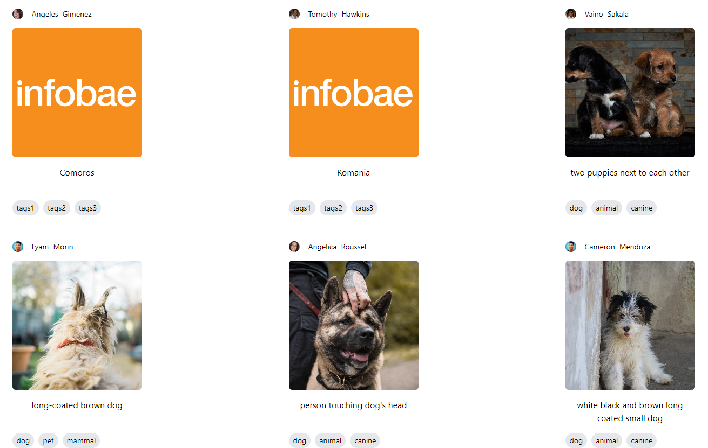
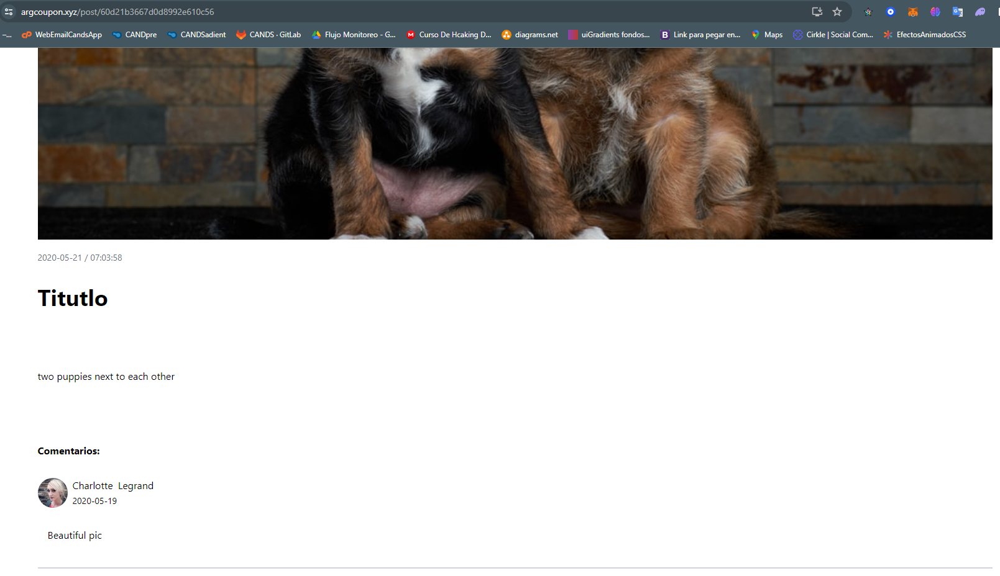
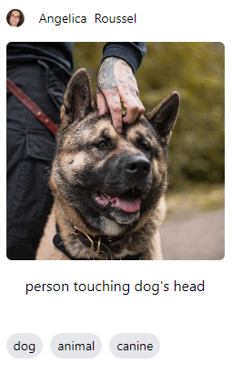
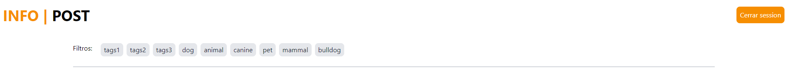
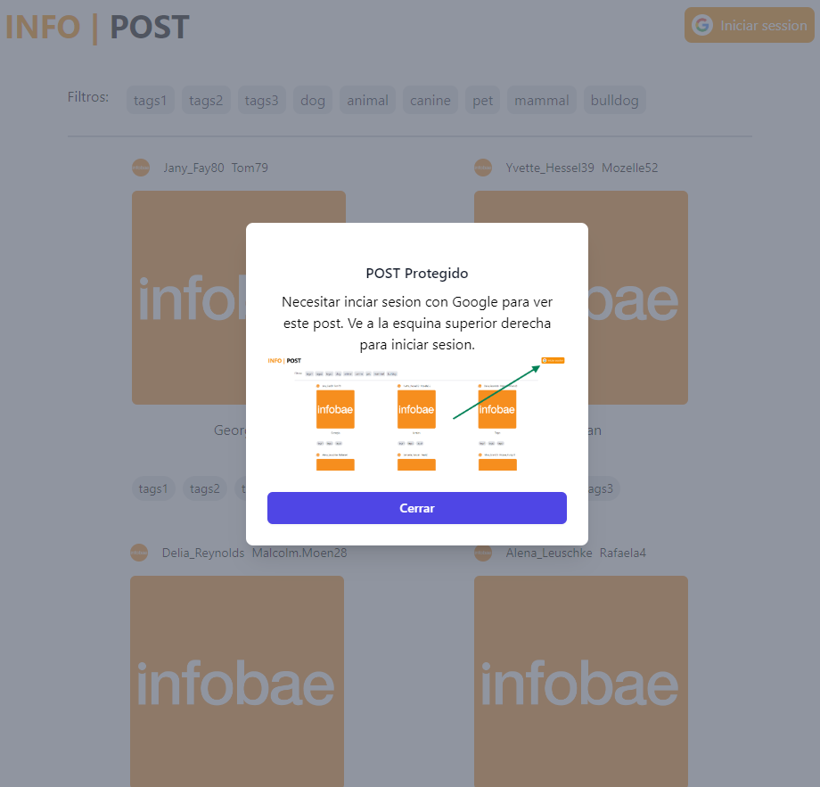
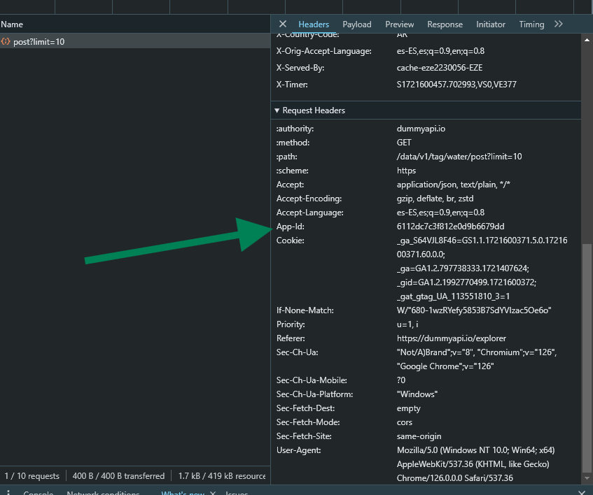
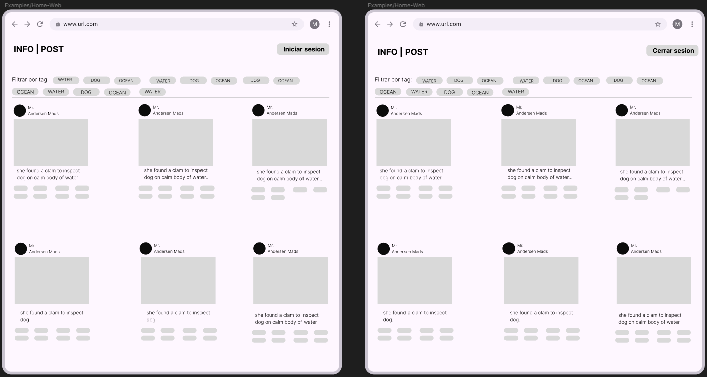

## Screen

### Rutas proteguidas

1. `/post/:id`

### Ruta Publicas

1. `/`

Este proyecto cumple con los requisitos que son los siguientes:

1. Post con imagen principal, tag y usuario quien lo publica
   

2. Al dar click aparece los comentarios(URL):
   

3. Sobre los POST aparece los tag y mas arriba estan los tag que se aplica un filtro cuando se selecciona
   
   

4. Vista protegida por Google SingIn.
   ` Si ignoramos el modal y apretamos el post, no nos redirigue a ninguna lugar ya que esta protegida. El modal es solo de aviso`
   

### Problemas que me encontre durante el proyecto

La api de `https://dummyapi.io/data/v1/` no funciona el login. Si el login funcionase me tendria que dar un "app-id" para uso personal.
Solucion: Tuve que agarrar la "app-id" que usan ellos en su web.

GitHub Pages no me permite hacer deploy, asi que tuve que armar una imagen con docker y subirlo en mi servidor ubuntu con nginx. La web es el siguiente link:
`https://argcoupon.xyz/`

### Steps to deploy to docker hub

1. docker image build -t almendraivan/infobae-post-almendra:tag .
2. docker push almendraivan/infobae-post-almendra:tag

3. docker run -dp 3000:3000 --name frontend-infobae almendraivan/infobae-post-almendra:v1

### Iniciar Localmente

1. npm install
2. npm start

Version de node v20.10.0

### Diseño en figma con la cual inicie

Despues fui cambiando ya que no tuve mas tiempo y fui improvisando

No hay .env (Pero deberia)
